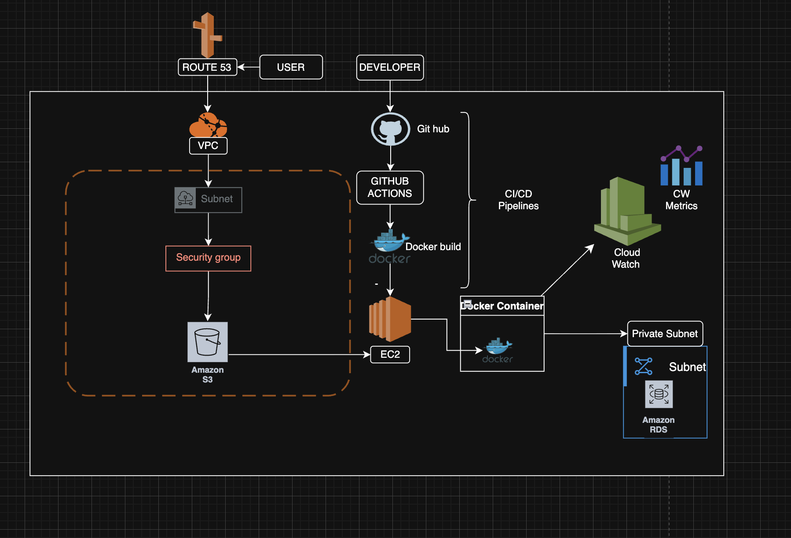

Python Monitoring Application

Project overview
The project is pythong based infrastructure Monitoring
tool.

The application monitors the below metrics:
- use CI/CD Pipelines
- Automatically deploy from GitHub
- Runs on AWS EC2
- Monitor Server Health
- Simulate real devops infrastructure monitoring 

The application is built using python and Flask and 
will later be containerized using Docker.

Deplpoyed the monitoring applications in production 
using:
Python, Docker, Github Actions, AWS EC2, C/CD 
Automation.

Project workflow 
Developer -> GitHub Repository -> GitHub Actions CI/CD
-> Build Iamge (Docker) -> DockerHub Registry -> AWS
EC2 Deployment -> Monitoring application running in 
container 

CI/CD workflow
- Developer pushes cod to GitHub
- GitHub actions pipeline triggers automatically
- Docker image is built
- Docker image is pushed to DockerHub
- AWS EC2 server pulls latest image
- Container redeploys automatically

Initial steps:
- Create a project folder and go insde the folder 
using below commands

-mkdir folder name
-cd folder name

- create a python file 
-touch folder name

Initialize Git

-git init
-git add .
-git commit -m "Initial commit"

Create a Git hub repo and connect GitHub Repo

-git branch -M main
-git remote add origin  link .git
-git push -u origin main

How to setup AWS services

Launch Ec2 

Install docker on EC2

-Sudo apt update 
-sudo apt install docker.io -y

Attached cloud formation template to automatically 
create AWS Services

push code to GitHub
-git add .
-git commit -m "Project update"
-git push

CI/CD Setup
 create GitHub actions workflow
-.github/workflows/deploy.yml

GitHub Actions flow
What does a pipeline do , it pulls the code and build 
a docker image , then it push to AWS ECR and deploy it 
to EC2

Monitoring setup 
-CW Ec2 CPU
-Docker logs
-Application logs

## Architecture Diagram

